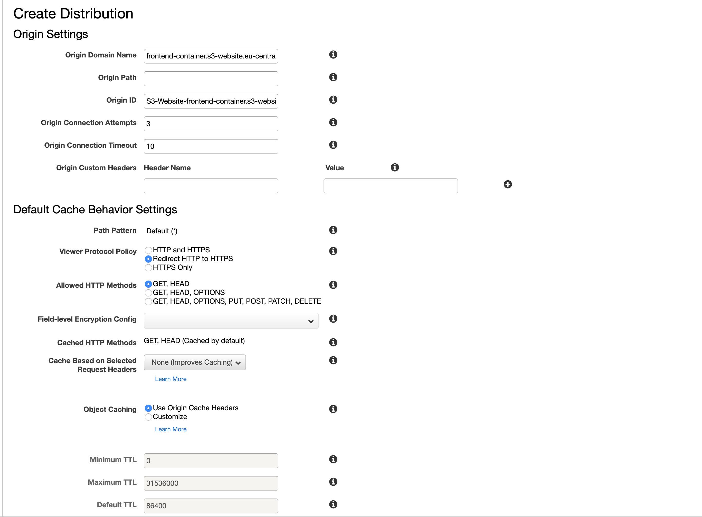

# Prerequirements
* Have your domain hosted in Amazon Route 53
* Have a SSL Certificate generated through Amazon Certificate Manager

# Preparing AWS for frontend

Since we're using a simple react app for frontend we can store it directly in a S3 bucket and have a Cloudfront distribution for pointing at it using SSL

* Login to your AWS account and go to S3
* Create two buckets with the following names: `www.domain.com` `domain.com`
    
We need to match the domain name to bucket name here since Cloudflare sends a HOST header which is used internally in AWS to map to the correct domain ------ TEST

We will use the `www.domain.com` as the main bucket for our project

* Go to `www.domain.com` bucket properties and select `Static Website Hosting`
* Fill in the `index document` with `index.html`
* Fill in the error document with `index.html`
* ~~Fill in the redirection rule with the following value~~ - not needed anymore, but let's keep it here
```
<RoutingRules>
    <RoutingRule>
        <Condition>
            <HttpErrorCodeReturnedEquals>404</HttpErrorCodeReturnedEquals>
        </Condition>
        <Redirect>
            <HostName>www.domain.com</HostName>
            <Protocol>https</Protocol>
            <ReplaceKeyPrefixWith>#!/</ReplaceKeyPrefixWith>
        </Redirect>
    </RoutingRule>
    <RoutingRule>
        <Condition>
            <HttpErrorCodeReturnedEquals>403</HttpErrorCodeReturnedEquals>
        </Condition>
        <Redirect>
            <HostName>www.domain.com</HostName>
            <Protocol>https</Protocol>
            <ReplaceKeyPrefixWith>#!/</ReplaceKeyPrefixWith>
        </Redirect>
    </RoutingRule>
</RoutingRules>
```
* Hit the save button

* Go to Permissions tab
* Uncheck `Block public access here!`

Add the following rule in the Bucket Policy tab
```
{
    "Version": "2012-10-17",
    "Statement": [
        {
            "Sid": "PublicReadGetObject",
            "Effect": "Allow",
            "Principal": "*",
            "Action": "s3:GetObject",
            "Resource": "arn:aws:s3:::frontend-container/*"
        }
    ]
}
```

To test this, you should upload sample index.html page and visit the endpoint listed in the `Static website hosting`

Let's move to our second bucket `domain.com`

This bucket will just be a redirect to our `www.domain.com` bucket

* Go to properties 
* Select `Static Webhosting`
* Check the `Redirect requests`
* Fill the `Target bucket or domain` with `www.domain.com`
* Fill the `Protocol` with `https` 


# Cloudfront setup

We will setup two distributions here, for each bucket.

Let's start with `www.domain.com` bucket

* Visit the Cloudfront and hit the `Create distribution` button
* Press the `Get started` button for the `Web` distribution
* Click the `Origin domain name` input and select your `www.domain.com` bucket
* Check the `Redirect HTTP to HTTPS` in the `Viewer protocol policy`
* In `Distribution Settings` select `Custom SSL Certificate` and select your issued Amazon Certificate Manager for your domain
* Type `index.html` in the `Default Root Object`
* After creating the distribution go to Edit Distribution
* Go to Behavior and edit the following:
    * In  `Forward Query String params` select `Forward all, cache all`
* Change the s3 url from default bucket to `www.domain.com.s3-website.{region}.amazonaws.com` -  this is needed for the redirect rule set in the bucket to apply
Repeat the above steps for the `domain.com` bucket

Changes only for the main cloudfront distribution - the `www` one in our case
* Edit your distribution
* Go to `Error page` and add the 404 page with response page path to `/index.html` and response code `200` - this will help cloudfront deal with 404 pages redirection back to React router instead of pointing that to a 404 page

# AWS Lambda setup
We will need to setup a Lambda@Edge function to correctly redirect the non-www domain to www one and keeping query parameters
Move to `us-virginia-1` and create a lambda function with the following content:
```
const path = require('path')
 
 exports.handler = (evt, ctx, cb) => {
    var cf = evt.Records[0].cf;
     var request = cf.request;
     var response = cf.response;
 
     if (response.status[0] === "3" && response.headers.location && response.headers.location[0] && request.querystring) {
         response.headers.location[0].value = response.headers.location[0].value.split('?')[0] + '?' + request.querystring;
     }
     
     cb(null, response);
 }
```

Deploy this function to your `non-www` cloudfront distribution as `origin response` event
We need this since the redirect from non-www to www strips duplicates the query parameters, thus the reset-password token or redirect-url will be lost during the redirection


# Domain setup
* Go to your `Hosted Zone` in Amazon Route 53
* Create an A record for `www.domain.com` and check the `Alias` checkbox
* Set the `Alias Target` to the domain name for the correct CDN - You will see this value when viewing your Cloudfront distributions, `Domain name` column
* Create an AAA record for the same domain, using the same steps as for the A record - this is for IPv6 domain

Repeat the above steps for `domain.com` bucket - note: leave the input blank empty


### This is for the moment with the Frontend setup, we will get back to that later

# Backend setup

* Setup your ec2 instance - I used a t2.micro
* Use the defaults until you arrive at the `Configure Security Group`
* The default will be only SSH access, we need to add `HTTP`, `HTTPS` and `Postgres` security groups
* ssh into your instance using the private key generated by AWS
ssh into your instance
* Install some dependencies
```
sudo apt-get update && sudo apt-get -y upgrade
sudo apt install autoconf bison build-essential libssl-dev libyaml-dev libreadline6-dev zlib1g-dev libncurses5-dev libffi-dev libgdbm5 libgdbm-dev postgresql-client libpq5 libpq-dev
```
* Install rbenv or rvm - I used rbenv here
```
git clone https://github.com/rbenv/rbenv.git ~/.rbenv
echo 'export PATH="$HOME/.rbenv/bin:$PATH"' >> ~/.bashrc
echo 'eval "$(rbenv init -)"' >> ~/.bashrc
source ~/.bashrc
 git clone https://github.com/rbenv/ruby-build.git ~/.rbenv/plugins/ruby-build 
rbenv install 2.5.3
rbenv global 2.5.3
echo "gem: --no-document" > ~/.gemrc
```
* Install bundler
```
gem install bundler -v 2.1.4
``` 
* Install nginx
```
sudo apt-get update
sudo apt-get install -y nginx
sudo service nginx restart
```
* Install passenger
```
sudo apt-get install -y dirmngr gnupg
sudo apt-key adv --keyserver hkp://keyserver.ubuntu.com:80 --recv-keys 561F9B9CAC40B2F7
sudo apt-get install -y apt-transport-https ca-certificates

sudo sh -c 'echo deb https://oss-binaries.phusionpassenger.com/apt/passenger bionic main > /etc/apt/sources.list.d/passenger.list'
sudo apt-get update

sudo apt-get install -y libnginx-mod-http-passenger

if [ ! -f /etc/nginx/modules-enabled/50-mod-http-passenger.conf ]; then sudo ln -s /usr/share/nginx/modules-available/mod-http-passenger.load /etc/nginx/modules-enabled/50-mod-http-passenger.conf ; fi
sudo ls /etc/nginx/conf.d/mod-http-passenger.conf

sudo service nginx restart
```
* Setup a subdomain in Route 53 which points to the EC2 instance public IP
* Install certbot
```
sudo apt-get update
sudo apt-get install software-properties-common
sudo add-apt-repository universe
sudo add-apt-repository ppa:certbot/certbot
sudo apt-get update
sudo apt-get install certbot python3-certbot-nginx
```
* Create a config file in `/etc/nginx/sites-available/001-api.conf` with the following value
```
server {
     server_name api.researchresultswebsite.com;
 
     root /home/ubuntu/mercury-analytics-api/current/public;
 
     passenger_enabled on;
     passenger_ruby /home/ubuntu/.rbenv/versions/2.5.3/bin/ruby;
     rails_env production;
 }
```
* Generate certbot certificate with `sudo certbot --nginx` and follow the steps in there to setup SSL

Let's move to Auth0 setup now

# Auth0 setup
* Login to your Auth0 account
* Go to Applications
* Hit the `Create application` button
* Name your app and `Machine to Machine`
* On the next screen select `Auth0 Management API`
* Filter the scopes by `users` and press the `All` link
* Click the `Authorize` button and you should be set for your API

Now we'll create the frontend application
* Go to Applications
* Hit the `Create application` button
* Name your app, select `Single Page App` and hit the button.

Let's configure the Frontend application
* Go to applications
* Select your frontend application
* In `Allowed Callback URLs` and set your domains callbacks in there
For example, if your domain is frontend.domain.com, you should point this to `https://front.domain.com/auth/auth0/callback`
* In `Allowed Logout URLs` set your domain (eg: `https://frontend.domain.com`)
* Same values for `Allowed Web Origin` and `Allowed Origins (CORS)` as in Logout URLs

Let's add the rules now and the email template
* Go to rules
* Click the `Create Rule`
* Find the `Link Accounts with Same Email Address`, select it and hit the `Save changes` button
* Go to `Emails / Provider` and setup your Email server
* Go to `Emails / Templates`, select the `Change Password` template from the dropdown and paste the template found in AUTH-0-RULES.md

This should be all configs for Auth0!

For setting Google Social login you need to follow the steps here: https://auth0.com/docs/connections/social/google#1-set-up-your-app-in-google

# Deploying the frontend app
* Install AWS CLI
* Setup AWS CLI with your IAM user that has full access to S3Buckets and Cloudfront distribution (we need to invalidate the cache when deploying new changes)
* Open `src/auth_config.json` in frontend app 
    * Modify the `client_id` value with the one generated in your Auth0 frontend app
    * Modify the `domain` value with the one generated in your Auth0 frontend app
* Open `src/utils/constants.js`
    * Modify the prod `[EnvTypes.PRODUCTION]` with the following
        ```
        [EnvTypes.PRODUCTION]: {
               APP_URL: Env.publicUrl,
               API_HOST: 'https://api.example.com',
               API_URL: 'https://api.example.com/api/v1',
             },
      ``` 
* Run the `BUCKET_NAME=www.example.com DISTRIBUTION_ID=YOUR_DISTRIBUTION_ID npm run-script s3deploy`

After this is done it should be up & running

# Deploying the backend app
* Go to root project
* Run `EDITOR=vim bundle exec rails credentials:edit`
    * app_host: YOUR_BASE_URL - this is needed when generating the asset host for logo 
    * auth0: (note: For Auth0 you'll need to open your Machine to Machine application from Applications and go to Settings tab)
        * iss: DOMAIN VALUE
        * audience: DOMAIN VALUE
        * management_api:
            * base_url: {DOMAIN_VALUE}/
            * client_id: CLIENT ID VALUE
            * client_secret: CLIENT SECRET VALUE
            * audience: {DOMAIN VALUE}/api/v2
    * aws:
        * access_key_id: IAM Access key 
        * secret_access_key: IAM Secret
        * region: bucket region
        * bucket: bucket name
    database:
        RDS_DB_NAME: mercury_analytics_api_production
        RDS_USERNAME: RDS name
        RDS_PASSWORD: RDS password
        RDS_HOSTNAME: RDS hostname
        RDS_PORT: RDS PORT
    smtp: 
      host: SMTP_HOST
      port: SMTP_PORT
      username: SMTP_USERNAME
      password: SMTP_PASSWOR
      tls: true
      from: DEFAULT_FROM_EMAIL
* Open `config/environments/production`
    * add `config.hosts << YOUR_HOSTNAME`


* Go to mercury-analytics-api project root and open `config/deploy/production.rb`
    * Set your IP and SSH key location for connecting to ec2 instance
* Open `config/deploy.rb` and make changes if you have other settings than the default ones
Notes: 
  * don't forget to add your SSH key for deploy user in github!
  * You'll need to manually create the database if it does not exist, since capistrano will not do this
Run `cap production deploy` and it should deploy the app based on your settings
Ssh into your machine to create a super user using the following rake task
`RAILS_ENV=production bundle exec rails users:create_admin_user\['your-email','MyPassword123'\]`


# Updates

I'm assuming that you already setup the Auth0 and credentials in the API app

## Setup S3

Go to s3 and create a new bucket


I named this one to frontend-container - no need to keep naming conventions for Amazon since we'll be pointing the Cloudfront to the s3 static website

In permissions tab uncheck the checkbox


Go to `Permissions` tab and add the below code

```
{
    "Version": "2012-10-17",
    "Statement": [
        {
            "Sid": "PublicReadGetObject",
            "Effect": "Allow",
            "Principal": "*",
            "Action": "s3:GetObject",
            "Resource": "arn:aws:s3:::frontend-container/*"
        }
    ]
}
```
Make sure you match the `Resource` key to your container-name
It should look like this:


Now you are ready for setting up the CloudFront distribution

## Setup CloudFront
Go to Cloudfront and add a new distribution with the following settings:



In the `Origin Domain Name` field set your s3 URL found here(The Endpoint URL):


Set your AWS Lambda@Edge function as Origin Response
Select your SSL Certificate and add your domain, which we will setup in the next part


Edit your distribution and go to Error page
Add the following in there:


Check the images in order to make an identical configuration


## Setup Route 53
Go to your hosted zone and add a new subdomain, as in the following image

For A Record


For AAA Record


## Deploying the frontend app
Set your API URL in the `constants.js` file
```
[EnvTypes.PRODUCTION]: {
        APP_URL: Env.publicUrl,
        API_HOST: 'https://api.aurelianb.com',
        API_URL: 'https://api.aurelianb.com/api/v1',
    },
```

Go to your terminal and run the deploy command - in my case is
 
```
DISTRIBUTION_ID=E1LZ079IZDQICA BUCKET_NAME=frontend-container npm run-script s3deploy
```

Note: this only works if you have a configured AWS CLI to your main account, or an account with s3 and cloudfront distribution full access

Alternative, you could use `react-scripts build` to build the package, then copy the `build/`  directory contents to your s3 bucket and then manually invalidate the cache

After the invalidation is finished, you should be able to access your staging environment

